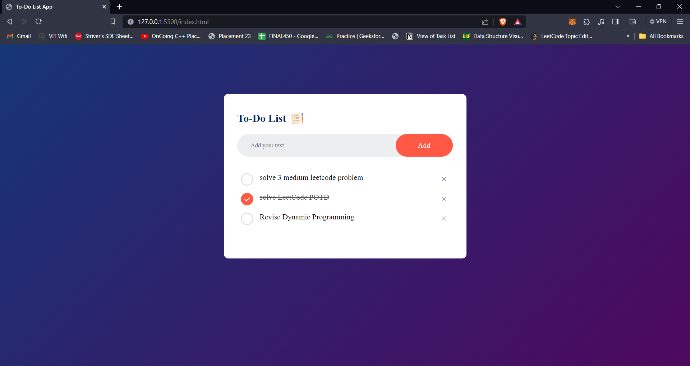

# To-Do List App

## [Live-Link](https://pratyush2331.github.io/T0-Do-List-App/)

A minimalistic To-Do List web application built with HTML, CSS, and JavaScript.

## Features

- Add tasks to your to-do list
- Mark tasks as complete
- Delete tasks
- Integrated Local Storage which utilizes `localStorage` for data persistence.
- Clean and intuitive user interface

## Getting Started

1. Clone the repository:

   ```bash
   git clone https://github.com/pratyush2331/To-Do-List-App.git


## Screenshots


